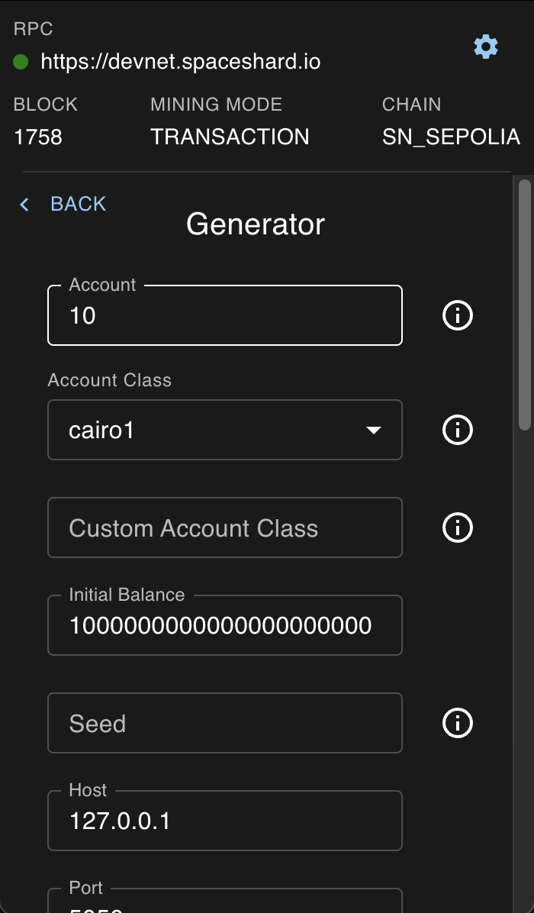
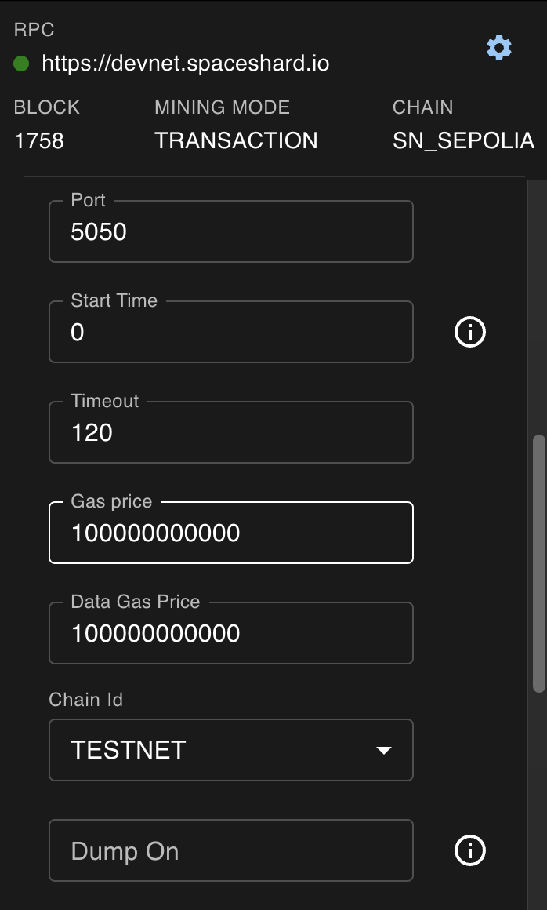
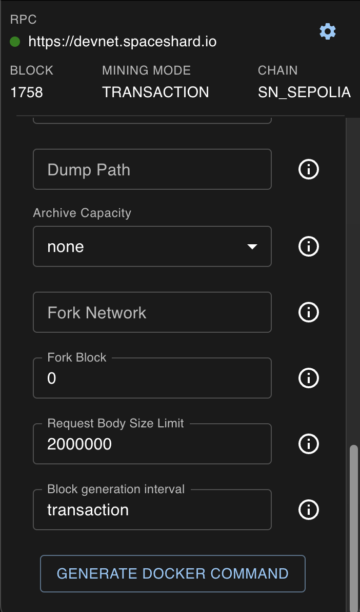
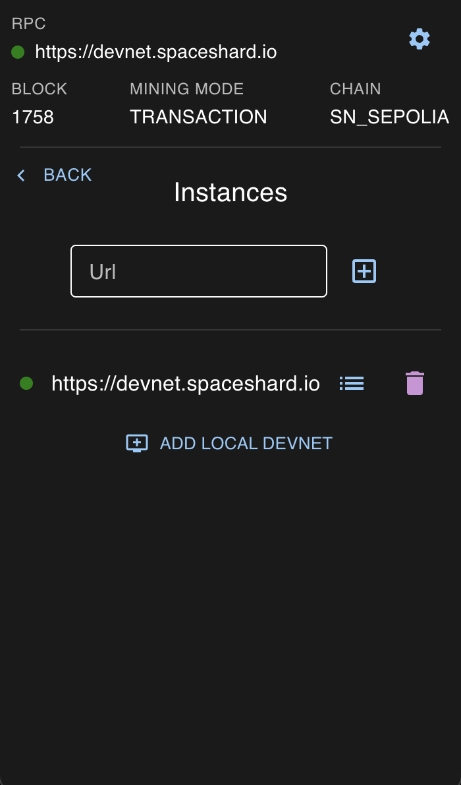

# Devnet Configuration

### Generate docker command

You can configure a Docker Command which will fire up a local Devnet Instance.

### Register and switch instances

You can register and then switch between local Devnet Instances.

